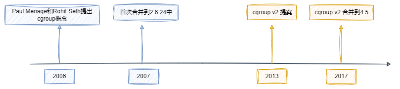

cgroup(control group)将一组任务与一个或多个子系统的一组参数相关联

用来控制,限制单个进程或者进程组的资源(CPU,内存,IO等等)

docker就是用cgroup技术进行container的资源限制

## cgroup的历史与演变

## cgroup v1

### 资源控制

涉及的资源控制组有:

1. **CPU** (`cpu` 子系统)：
   - CPU 访问和使用的限制和控制。
   - 可以设置进程组的相对权重。
2. **CPU 帐户** (`cpuacct` 子系统)：
   - 报告进程组使用的总CPU时间。
3. **内存** (`memory` 子系统)：
   - 限制进程组的内存使用。
   - 报告内存使用统计信息。
   - 可以设置硬限制和软限制。
4. **块设备I/O** (`blkio` 子系统)：
   - 控制和限制块设备的输入/输出。
   - 可以设置读/写的I/O带宽限制或IOPS限制。
5. **网络** (`net_cls` 和 `net_prio` 子系统)：
   - `net_cls`：标记网络数据包，使其可以被流量控制工具（如 tc）处理。
   - `net_prio`：为每个网络接口设置优先级。
6. **设备访问** (`devices` 子系统)：
   - 控制进程组对设备的访问。
7. **Freezer** (`freezer` 子系统)：
   - 允许你暂停或恢复进程组的所有任务。
8. **进程号** (`pid` 子系统)：
   - 限制进程组中的进程数量。
9. **cpuset** (`cpuset` 子系统)：
   - 指定进程组可以使用的CPU和内存节点。
10. **perf_event** (`perf_event` 子系统)：
    - 允许监控进程组的性能事件。
11. **cgroup 命名空间** (`ns` 子系统)：
    - 为进程组提供独立的cgroup命名空间视图。
12. **rdma** (`rdma` 子系统)：
    - 管理和限制RDMA/InfiniBand资源。

### Hierarchy 层次结构

层次结构是cgroup的组织方式,决定了对于进程如何进行分组和管理.

## cgroup v2

## v1与v2差异点

## 参考资料

1. [docker 容器基础技术：linux cgroup 简介 | Cizixs Write Here](https://cizixs.com/2017/08/25/linux-cgroup/)
2. [Control Groups — The Linux Kernel documentation](https://www.kernel.org/doc/html/v5.10/admin-guide/cgroup-v1/cgroups.html)
3. [Control Group v2 — The Linux Kernel documentation](https://www.kernel.org/doc/html/v5.10/admin-guide/cgroup-v2.html)
4. [Linux Cgroups V1 介绍与使用 | IceberGu](https://icebergu.com/archives/linux-cgroups-v1)
5. [Linux资源管理之cgroups简介 - 美团技术团队 (meituan.com)](https://tech.meituan.com/2015/03/31/cgroups.html)
